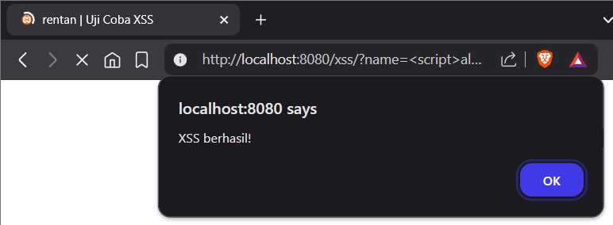
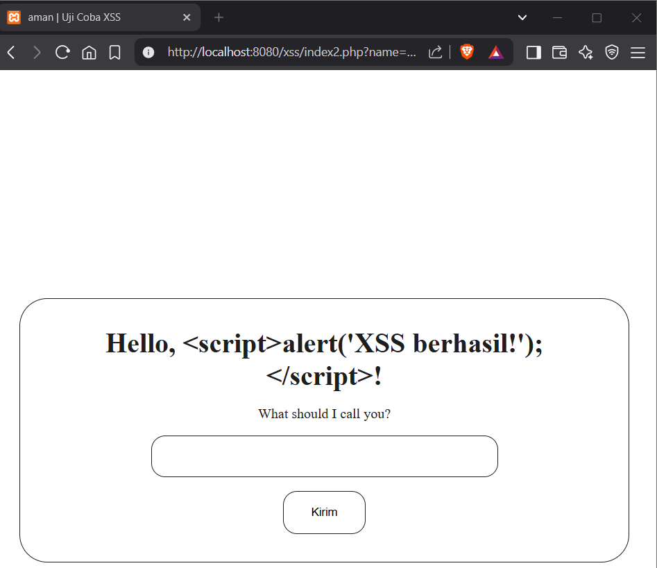
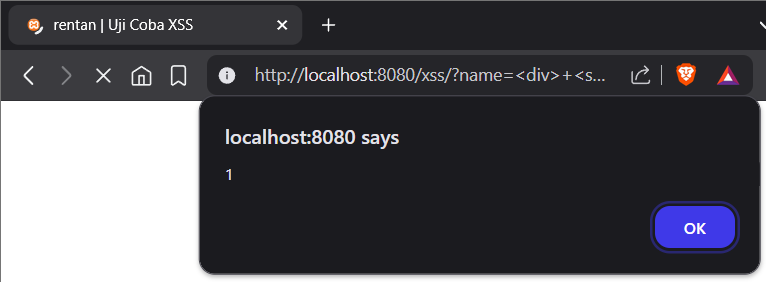
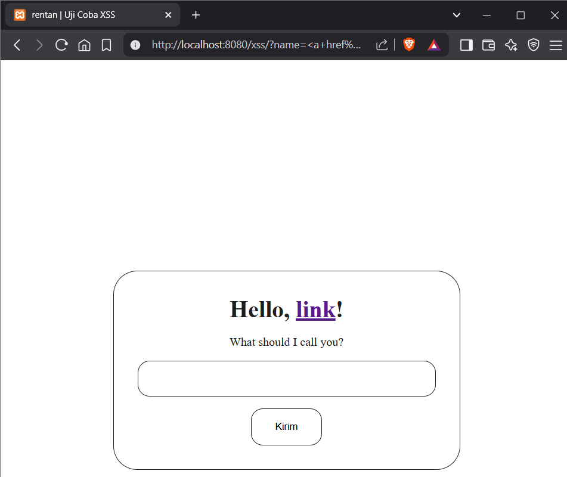
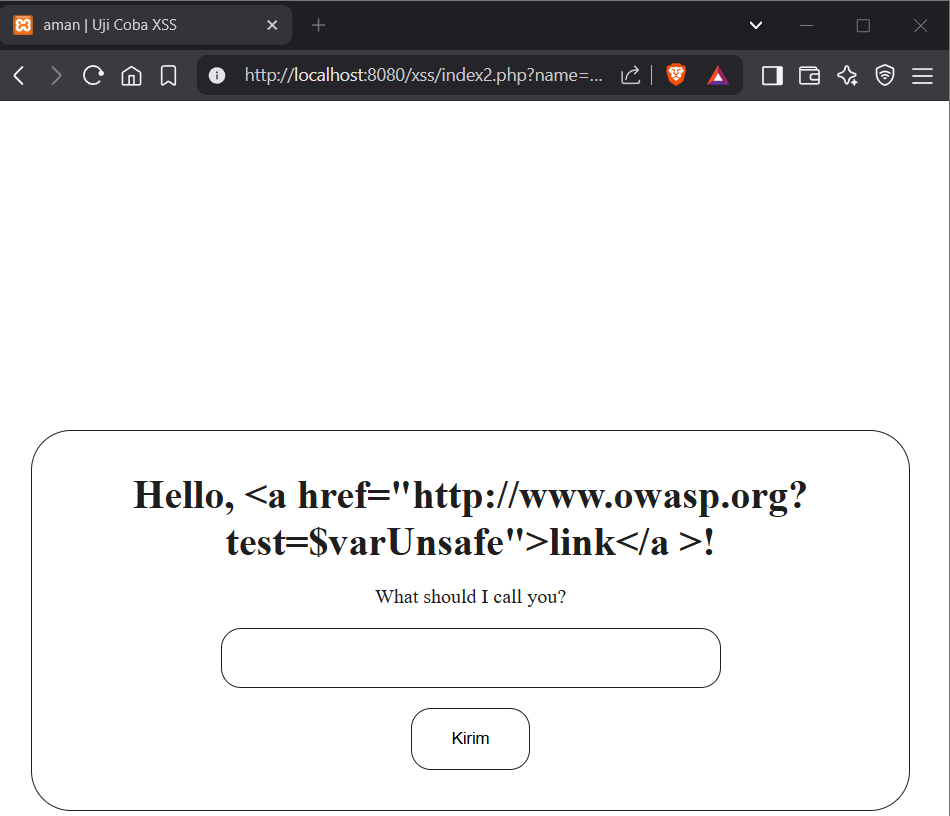
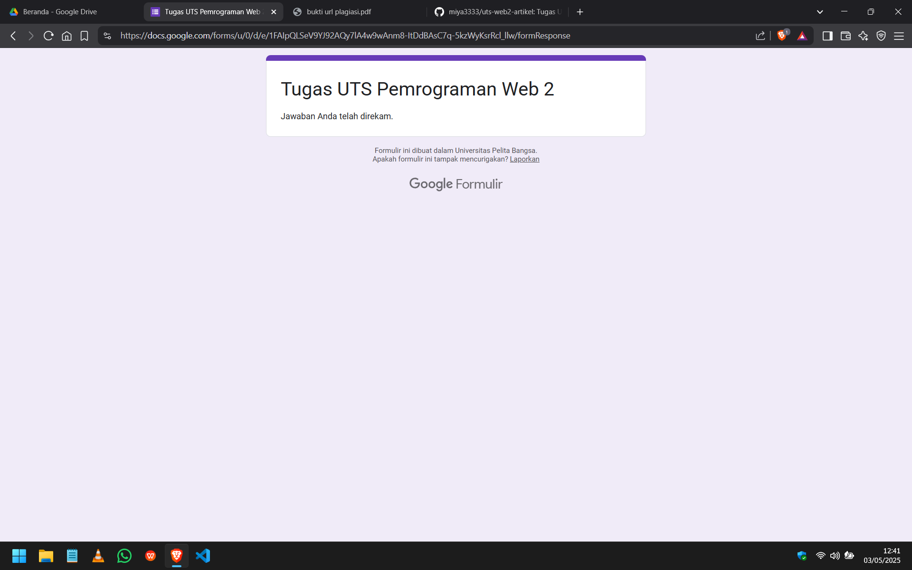

# Cross-Site Scripting (XSS)
Tugas UTS Pemrograman Web2 - Semester 4

## 🔗 [Link Medium](https://medium.com/@alher6555/memahami-dan-mengatasi-kerentanan-cross-site-scripting-xss-dalam-keamanan-web-0cfecf5d8825)

## 📸 Tampilan
### Uji coba 1️⃣:
> Pada web yang tingkat keamanan rentan:

> Pada web yang tingkat keamanan cukup baik:

---

### Uji coba 2️⃣:
> Pada web yang tingkat keamanan rentan:

> Pada web yang tingkat keamanan cukup baik:

---

### Uji coba 3️⃣:
> Pada web yang tingkat keamanan rentan:

> Pada web yang tingkat keamanan cukup baik:

---

## 📝 Submit Form

